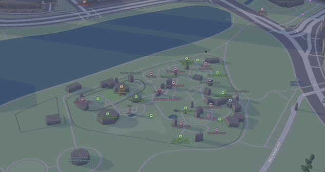

# "My First Experiences In The Bay" App

## What did I build?

["My First Expereinces In The Bay" App](https://deyawna.github.io/my-first-map/)  is a one-page, completely free map website that displays markers of my first experiences around the bay area. This includes locations i personally have fond memory of to locations I don't even remember being in. All locations are very memorial to me in a way.

Users can...
1. **Check out all locations ive visited**, by tapping the 3 red markers in different locations on the screen. 
2. **Explore each locationp** by using gestures to zoom in/out anywhere, rotate the map orientation, or change the pitch (angle).
3. **Observe the cool map style I selected** Not only do you get to see locations ive been to but there is a cool effect making the visuals much more interesting.

Here's a demo:

## Why did I build this?

I thought about some of the areas that helped me become me. These locations were at different ages of my life which makes it more important. 

I set these goals for my product:

1. Families/guardians should **have detailed knowledge** of higher-risk student activities.
2. Students should **practice engaging** with visualized spatial data to **independently answer their own questions** about each day's ride location, duration, elevation, Points of Interest, or itinerary.

## Tech stack

To build this app, I used the following tools:

1. [Google My Maps](https://www.google.com/maps/d/u/0/), for generating the route lines, and exporting the geometries in `KML` format.
1. [togeojson](https://www.npmjs.com/package/@mapbox/togeojson) to convert `KML` files into `geoJSON`.
2. [Mapbox GL JS](https://docs.mapbox.com/mapbox-gl-js/guides) library, for styling and displaying maps and route lines, and adding camera behaviors (flyto animations).
3. [Google Sheets](https://docs.google.com/spreadsheets), for planning and line-by-line itineraries (including formulas to calculate durations), and publishing a single tab as an htm file.
4. [Visual Studio Code](https://code.visualstudio.com/download) free IDE, with [Live Server](https://marketplace.visualstudio.com/items?itemName=ritwickdey.LiveServer) and [Markdown All in One](https://marketplace.visualstudio.com/items?itemName=yzhang.markdown-all-in-one) extensions.
5. [GitHub pages](https://docs.github.com/en/pages/getting-started-with-github-pages/creating-a-github-pages-site), for publishing the app for free!

## Feature Spotlight

One key feature I want to spotlight is one of the map style of my app. 

As soon as you open the map, you notice that the theme isnt the default colors blue, green, and grey. My style adds a cool purple, blue, and grey effect that makes the app much more interesting. Here is how I set it up...:

Following [this example](https://docs.mapbox.com/mapbox-gl-js/example/add-terrain/), I first added [this](https://docs.mapbox.com/data/tilesets/reference/mapbox-terrain-dem-v1) Mapbox raster tileset `mapbox://mapbox.mapbox-terrain-dem-v1` to the map as a source. This tileset contains a Digital Elevation Model (DEM) encoded in the RGB values. So, by using `.setTerrain`, we can use the elevation values in the tileset to enable topographical extrusion – to make the map 3D!

So, why 250%? Well, what's the point of adding subtle (realistic) terrain, when my goal is to **prepare students to face some aggressive climbs**? _Those hills should look as mean as they feel._

Check it out:

.png>)

_Exaggerating the elevation profile makes the map more exciting._

## Contributions

Feel free to copy the code if you want it! Comments are welcome on [this blog post](https://domlet.github.io/posts/bike-the-bay/).
